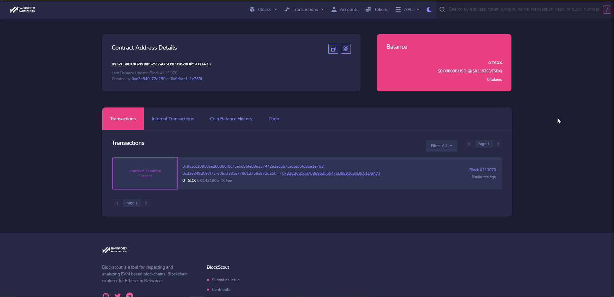

# <b>Deploy with Truffle</b>
---

In this section we will show you how to utilize the [Truffle Suite](https://www.trufflesuite.com/truffle) to develop Smart Contracts for Zukma.
Tuffle, in short, is a solidity suite that helps you to test your code. 

Let's start with installing the technical requirements.

## **Installing Technical Requirements**
---

To use Truffle we need to install NodeJS v8.9.4 or later and we need a running eth-client.

!!! Note
    Since Zukma is fully Ethereum compatible you can use **Ganache** as the preferred eth-client

 Please go ahead and install NodeJS and Ganache.

- [NodeJS](https://nodejs.org/en/)
- [Ganache](https://www.trufflesuite.com/ganache)

After you installed NodeJS and Ganache, you can execute the following command in your Terminal to install Truffle

```
npm install -g truffle
```

## ** Creating a Project**
---

In this guide we will utilize the MetaCoin Truffle Box, which is a Truffle project template. 
The MetaCoin Box allows us to create an ERC-20 token on Zukma that can be transferred between accounts. 

1. Create a new folder for your Truffle project and navigate into it:

```
mkdir MetaCoin
cd MetaCoin
```

2. Download und unbox the MetaCoin Box

```
truffle unbox metacoin
```

!!! Hint
    You can use the `truffe unbox <box-name>` command to download and unbox any [truffle box](https://www.trufflesuite.com/boxes)

!!! Hint
    If you want to start from scratch please use `truffle init`

Once you unboxed MetaCoin, you will be greeted with a project structure like this:

- `contracts/`: Directory for Solidity Contracts
- `migrations/`: Directory for scriptable deployment files
- `test/`: Directory for test files for testing your application and contracts
- `truffle.js`: Truffle configuration file 


## **Exploring the Project**
---

1. Open the `contracts/MetaCoin.sol` file in a text editor. This is a smart contract (written in Solidity) that creates a MetaCoin token. Note that this also references another Solidity file `contracts/ConvertLib.sol` in the same directory.
2. Open the `contracts/Migrations.sol` file. This is a separate Solidity file that manages and updates the status of your deployed smart contract. This file comes with every Truffle project, and is usually not edited.
3. Open the `migrations/1_initial_migration.js` file. This file is the migration (deployment) script for the Migrations contract found in the `Migrations.sol` file.
4. Open the `migrations/2_deploy_contracts.js` file. This file is the migration script for the MetaCoin contract. (Migration scripts are run in order, so the file beginning with 2 will be run after the file beginning with 1.)
5. Open the `test/TestMetaCoin.sol` file. This is a test file written in Solidity which ensures that your contract is working as expected.
6. Open the `test/metacoin.js` file. This is a test file written in JavaScript which performs a similar function to the Solidity test above.
7. Open the `truffle-config.js` file. This is the Truffle configuration file, for setting network information and other project-related settings. The file is blank, but this is okay, as we'll be using a Truffle command that has some defaults built-in.

!!! hint
    We will adjust the `truffle-config.js` later to deploy the Token to Ganache and later to Zukma

## **Testing**
---

Testing your smart contracts is an important step in the development pipeline. To run a test of the MetaCoin contract open up a terminal and run the solidity test:

### **Run the Solidity Test**
```
truffle test ./test/TestMetaCoin.sol
```

you will see the following output:

```
  TestMetaCoin
    √ testInitialBalanceUsingDeployedContract (607ms)
    √ testInitialBalanceWithNewMetaCoin (457ms)


  2 passing (16s)

```

### ***Run the Javascript Test**

```
truffle test ./test/metacoin.js
```

You will see the following output:

```
  Contract: MetaCoin
    √ should put 10000 MetaCoin in the first account (126ms)
    √ should call a function that depends on a linked library (258ms)
    √ should send coin correctly (976ms)


  3 passing (1s)
```

!!! Success
    The solidity and javascript test were successfull!


## **Compiling the Smart Contract**
---

After the successfull test we are ready to compile the smart contracts within the `contracts/` folder. 

```
truffle compile
```

You will see the following output:

```
Compiling your contracts...
===========================
> Compiling .\contracts\ConvertLib.sol
> Compiling .\contracts\MetaCoin.sol
> Compiling .\contracts\Migrations.sol
> Artifacts written to .\build\contracts
> Compiled successfully using:
```

## **Migrating with Ganache**
---

To migrate or upload your smart contract to the Ganache Blockchain you need to tell truffle where it to deploy the contract. 
We do this by adjusting the `truffle-config.js` file as follows:

- Open `truffle-config.js` in a text editor and replace the content with the following:

```javascript
module.exports = {
  networks: {
    development: {
      host: "127.0.0.1",
      port: 7545,
      network_id: "*"
    }
  }
};
```
Save and close the file 

### **Launch Ganache**


### **Mirgrate to Ganache**

Now that we told truffle where to migrate the contracts we can migrate.

```
truffle migrate
```

You will see the following output:

```
Compiling your contracts...
===========================
> Compiling .\contracts\ConvertLib.sol
> Compiling .\contracts\MetaCoin.sol
> Compiling .\contracts\Migrations.sol
> Artifacts written to C:\Users\john\Documents\zukma\EVM-Tutorial\build\contracts
> Compiled successfully using:
   - solc: 0.5.16+commit.9c3226ce.Emscripten.clang

PS C:\Users\john\Documents\zukma\EVM-Tutorial> truffle migrate

Compiling your contracts...
===========================
> Compiling .\contracts\ConvertLib.sol
> Compiling .\contracts\MetaCoin.sol
> Compiling .\contracts\Migrations.sol
> Artifacts written to C:\Users\john\Documents\zukma\EVM-Tutorial\build\contracts
> Compiled successfully using:
   - solc: 0.5.16+commit.9c3226ce.Emscripten.clang


Starting migrations...
======================
> Network name:    'development'
> Network id:      5777
> Block gas limit: 6721975 (0x6691b7)


1_initial_migration.js
======================

   Deploying 'Migrations'
   ----------------------
   > transaction hash:    0x7f94b5d6852bae542f3c2d89e335a309243e54da0bbe96a3c1b863b40a4f547b
   > Blocks: 0            Seconds: 0
   > contract address:    0x475D507822741736A110e25698612C9Eb4ECc635
   > block number:        1
   > block timestamp:     1634129141
   > account:             0x456ad8e2CBF08FCde3C75D169ddF9C20e00F51F4
   > balance:             99.9967165
   > gas used:            164175 (0x2814f)
   > gas price:           20 gwei
   > value sent:          0 ETH
   > total cost:          0.0032835 ETH


   > Saving migration to chain.
   > Saving artifacts
   -------------------------------------
   > Total cost:           0.0032835 ETH


2_deploy_contracts.js
=====================

   Deploying 'ConvertLib'
   ----------------------
   > transaction hash:    0x0644f4e5186e058e18565b13db350ff8f0158c1f5a8f551741b55d11c76fea7d
   > Blocks: 0            Seconds: 0
   > contract address:    {==0x0Da4E500c4419860688284687efdF743337FE8ab==}
   > block number:        3
   > block timestamp:     1634129143
   > account:             0x456ad8e2CBF08FCde3C75D169ddF9C20e00F51F4
   > balance:             99.99396028
   > gas used:            95470 (0x174ee)
   > gas price:           20 gwei
   > value sent:          0 ETH
   > total cost:          0.0019094 ETH


   Linking
   -------
   * Contract: MetaCoin <--> Library: ConvertLib (at address: 0x0Da4E500c4419860688284687efdF743337FE8ab)

   Deploying 'MetaCoin'
   --------------------
   > transaction hash:    0xed1abbaf5d5cf4260c69cbec427b9a1b924302cf08b9e7d8e20920b5410bb927
   > Blocks: 0            Seconds: 0
   > contract address:    {==0x2E2EB10E302b2551C2788baBAe0d5981c18b4DDf==}
   > block number:        4
   > block timestamp:     1634129144
   > account:             0x456ad8e2CBF08FCde3C75D169ddF9C20e00F51F4
   > balance:             99.98822922
   > gas used:            286553 (0x45f59)
   > gas price:           20 gwei
   > value sent:          0 ETH
   > total cost:          0.00573106 ETH


   > Saving migration to chain.
   > Saving artifacts
   -------------------------------------
   > Total cost:          0.00764046 ETH


Summary
=======
> Total deployments:   3
> Final cost:          0.01092396 ETH
```

This shows the transaction IDs and {==addresses of your deployed contracts==}. It also includes a cost summary and real-time status updates.

!!! hint
    **Hint:** Your transaction IDs and contract addresses may be different from the above.

In Ganache, click the "Transactions" button to see that the transactions have been processed.


!!! success
    You deployed a smart contract to the Ganache Blockchain!

## **Migrate to Zukma**
---

To deploy the smart contracts to Zukma, we need to make some adjustments.
First of all we need to install the truffle HDWallet package as follows:

`npm install @truffle/hdwallet-provider`

HD Wallet is basically an instance of your wallet e.g., MetaMask that has access to the Zukma Network. 
Since a contract deployment involves transactions, you need to have your private key or your seed phrase ready.

Open the `truffle-config.js` file and replace its content with the following code:

```javascript
const HDWalletProvider = require("@truffle/hdwallet-provider");
const privKey = '{==YOUR PRIVATE KEY GOES HERE==}';

module.exports = {  
    compilers: {    
        solc: {      
            version: "^0.6.0",
        }
    },  
    networks: {
        Zukma: {
            provider: () => new HDWalletProvider({
                privateKeys: [ privKey ],
                providerOrUrl: "https://rpc.zukma.org",
            }),
            network_id: 142,
        },  
    } 
}
```
Save the file.
You notice a few facts from here, our chainId is 142 and we are using solc version above ^0.6.0.

!!! Hint
    Make sure that the wallet which is attached to the private key you provided earlier is funded sufficiently to pay for the gas needed to deploy the smart contracts.

### **Migrate your Contracts to Zukma**

To deploy the smart contracts within your project you need to execute the following command:

```
truffle --network development migrate
```

You should see the following output:

```
Compiling your contracts...
===========================
√ Fetching solc version list from solc-bin. Attempt #1
√ Downloading compiler. Attempt #1.
> Compiling .\contracts\ConvertLib.sol
> Compiling .\contracts\MetaCoin.sol
> Compiling .\contracts\Migrations.sol
√ Fetching solc version list from solc-bin. Attempt #1
> Artifacts written to C:\Users\john\Documents\zukma\EVM-Tutorial\build\contracts
> Compiled successfully using:
   - solc: 0.6.12+commit.27d51765.Emscripten.clang


Starting migrations...
======================
> Network name:    'Zukma Smart Chain'
> Network id:      77
> Block gas limit: 30000000 (0x1c9c380)


1_initial_migration.js
======================

   Deploying 'Migrations'
   ----------------------
   > transaction hash:    0x69c148fd82661cafb34a7c3df6d4efa714ed9a4553104def2c26a95cde4e1d6f
   > Blocks: 1            Seconds: 4
   > contract address:    0x37b35EAab7C6a52Fb6cd23CcBadc18CF075F6dF6
   > block number:        113067
   > block timestamp:     1634138652
   > account:             0xd3e849B097f7cFe0fdD381e778012759a972d250
   > balance:             99.99204025
   > gas used:            159195 (0x26ddb)
   > gas price:           50 gwei
   > value sent:          0 ETH
   > total cost:          0.00795975 ETH


   > Saving migration to chain.
   > Saving artifacts
   -------------------------------------
   > Total cost:          0.00795975 ETH


2_deploy_contracts.js
=====================

   Deploying 'ConvertLib'
   ----------------------
   > transaction hash:    0xc5b4688c876ee566e2ae53b76dbbdbb820e3f71faf0360d0a9aabe32d2b9b8a5
   > Blocks: 0            Seconds: 4
   > contract address:    0xBd41c64fB0531ad8579984F521A23c9B27AC25C5
   > block number:        113069
   > block timestamp:     1634138664
   > account:             0xd3e849B097f7cFe0fdD381e778012759a972d250
   > balance:             99.98513905
   > gas used:            95686 (0x175c6)
   > gas price:           50 gwei
   > value sent:          0 ETH
   > total cost:          0.0047843 ETH


   Linking
   -------
   * Contract: MetaCoin <--> Library: ConvertLib (at address: 0xBd41c64fB0531ad8579984F521A23c9B27AC25C5)

   Deploying 'MetaCoin'
   --------------------
   > transaction hash:    0x9dacc10950ae2b6386f0c75a6d86fe88e337442a2adbb7cadceb5fd85a1e763f
   > Blocks: 1            Seconds: 4
   > contract address:    {==0x32C3681dB7b86852555475D9E91620Dfc51D3A73==}
   > block number:        113070
   > block timestamp:     1634138670
   > account:             0xd3e849B097f7cFe0fdD381e778012759a972d250
   > balance:             99.970821
   > gas used:            286361 (0x45e99)
   > gas price:           50 gwei
   > value sent:          0 ETH
   > total cost:          0.01431805 ETH


   > Saving migration to chain.
   > Saving artifacts
   -------------------------------------
   > Total cost:          0.01910235 ETH


Summary
=======
> Total deployments:   3
> Final cost:          0.0270621 ETH
```

!!! Success
    Congrats, you deployed your first smart contracts on the Zukma Network!

### **Check Deployment on Network Explorer**

To verfiy the successfull deployment head over to the <a href="https://evm.zukma.org/" target="_blank">EVM Testnet Explorer</a> and search for your {==Contract Address==}.



### **Interact with the Contract**

Since we didn't connect the logic of the smart contracts with a front end we need to interact with our contracts via the console.
You can do this in the following ways:

1. Invoke the truffle console:

```
truffle console 
```

You will see the following prompt:

```
truffle(development)>
```

2. Begin by establishing both the deployed MetaCoin contract instance and your Zukma wallet

!!! hint
    It is normal to get an `undefined` as response from the console after you executed one command

```
let instance = await MetaCoin.deployed()
let accounts = await web3.eth.getAccounts()
```

3. Check the metacoin balance of the account that deployed the contract:

```
let balance = await instance.getBalance(accounts[0])
balance.toNumber()
```

4. See how much ether that balance is worth (and note that the contract defines a metacoin to be worth 2 ether):

```
let ether = await instance.getBalanceInEth(accounts[0])
ether.toNumber()
```

5. Transfer some metacoin from one account to another:

```
instance.sendCoin({==TARGET ADDRESS==}, 500)
```
You should see the following result:

```
{
  tx: '0x3a81b73b5f9b22ba739b2ba1072ac2b51efa2c5655c4d64f4147937bf5b627ae',
  receipt: {
    blockHash: '0x848addd30c96393e5d1f3dddfd633f0d2ffba0b97b15d2a566eba76d7863f63c',
    blockNumber: 113352,
    contractAddress: null,
    cumulativeGasUsed: 47314,
    from: '0xd3e849b097f7cfe0fdd381e778012759a972d250',
    gasUsed: 47314,
    logs: [ [Object] ],
    logsBloom: '0x00000000000000000000000000000000000000000000000000000008000000000000100001000000000000000000000000000000000000000000000000000000000000000000000000000008000000000000000000000000000000000000000400000000000000000000000000000000000000000000000000000010000000000000000000000000004000000000000004000000000000000000000000000000000004000000000000000000000000000000000000000000000000000000000000000202000000000000000000000000000000000000000000000000000000000000000000000000000000000000000000000000000000000008000000000000',
    status: true,
    to: '0x32c3681db7b86852555475d9e91620dfc51d3a73',
    transactionHash: '0x3a81b73b5f9b22ba739b2ba1072ac2b51efa2c5655c4d64f4147937bf5b627ae',
    transactionIndex: 0,
    rawLogs: [ [Object] ]
  },
  logs: [
    {
      address: '0x32C3681dB7b86852555475D9E91620Dfc51D3A73',
      blockHash: '0x848addd30c96393e5d1f3dddfd633f0d2ffba0b97b15d2a566eba76d7863f63c',
      blockNumber: 113352,
      logIndex: 0,
      removed: false,
      transactionHash: '0x3a81b73b5f9b22ba739b2ba1072ac2b51efa2c5655c4d64f4147937bf5b627ae',
      transactionIndex: 0,
      transactionLogIndex: '0x0',
      id: 'log_cdcbe184',
      event: 'Transfer',
      args: [Result]
    }
  ]
}
```

6. Check the balance of the account that received the metacoin:

```
let received = await instance.getBalance({==TARGET ADDRESS==})
received.toNumber()
```

7. Check the balance of the account that sent the metacoin:

```
let newBalance = await instance.getBalance(accounts[0])
newBalance.toNumber()
```
!!! Success
    Congrats, you succesfully depolyed 3 smart contracts to Zukma via Truffle and Meta Mask!

## **Continue Learning**
---

- Please check Truffle's fantastic docs, guides and tutorials :heart: : [Truffle](https://www.trufflesuite.com/docs) 

<br></br>

<p align=right> Written by Zukma Team </p>
