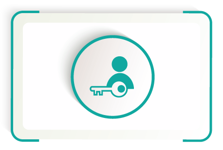
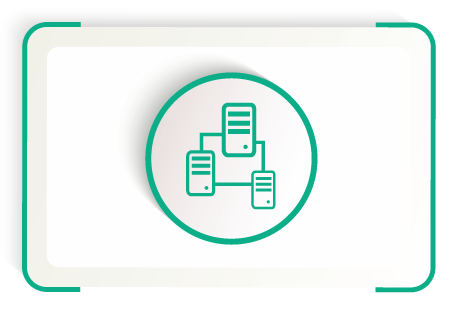
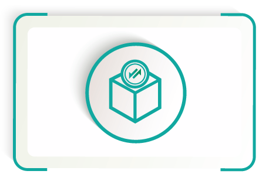
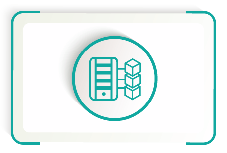
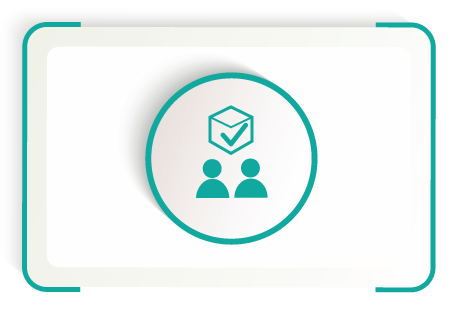
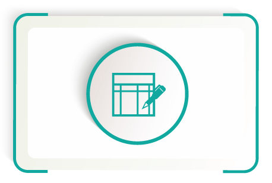
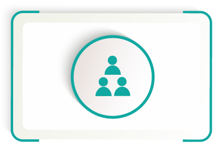
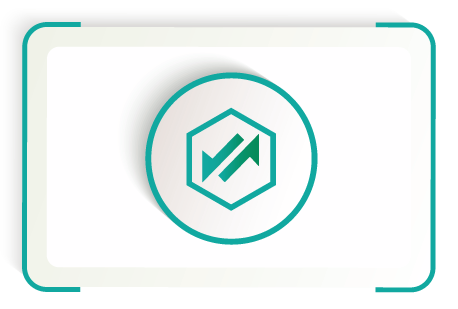
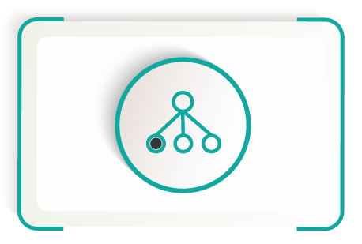
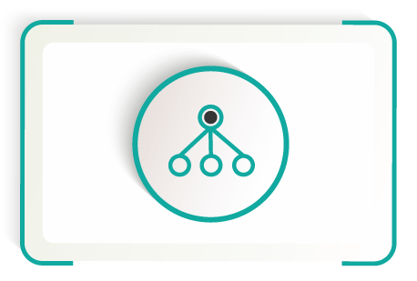

# <b>WELCOME TO</b>

Welcome to the Zukma Documentation.

The Documentation serves as the central source of truth for Zukma. It is a community-focused initiative led by the Zukma team to keep an up-to-date resource on the best information for learning, building, or maintaining on Zukma Network.

---
!!! Warning
    Work in progress content can change ,and it's not definitive :building_construction:.

## **What is the Zukma Web 3.0 Ecosystem?**

The Zukma ecosystem consists of blockchains, the main chain **Zukma** and an innovator blockchain called **Zukma Network** which holds real economic value and is all about innovating the space of Web 3.0 based DeFi - learn more about <a href="https://www.zukma.org/" target="_blank">Zukma Network</a> here.

Zukma is a blockchain network with the core pillars in Decentralize Treasury, cross-chain operability and Web3. The networks have an advanced suite of <a href="https://docs.zukma.org/what-to-try/democracy/" target="_blank">governance</a> tools and, using the Substrate framework that allows autonomous deployment of upgrades. The Zukma Network are adapting therefore to the growing needs of a DeFi loving community without the risk of Hardfork by blockchain forks.

!!! Tip
    You can read more about our Governance Suite <a href="https://docs.zukma.org/what-to-try/democracy/" target="_blank">here</a>.

By connecting the three pillars (Decentralization, Cross-Chain Operability and Forkless Upgrades) the Zukma ecosystem serves as a foundational layer for a truly decentralized DeFi network, where DeFi users control their data and are not limited by trust bounds within the network.

## **What is our mission?**

We’re on a mission to truly decentralize finance.
We revolutionize the future of DeFi by providing the industry-leading ecosystem, blockchain, exchange and end-to-end financial platform within a community-governed ecosystem.

Why do we need Zukma to help achieve true Decentralization?

The distribution of funds in the crypto space is still relatively centralized with the majority of funds in the hands of relatively few.
Part of this is because the technology is still in its youth and adoption still hasn’t reached the masses, although the path towards real mass adoption is getting clearer by the day.
The Problem of centralized funds still persists as a lot of coins and tokens are in the hands of a few big players in the industry.

In order to further disperse these financial resources and give everyone a fair chance of participating in an independent market, exchanges mark a pivotal point. A widespread allocation is only possible if there are a lot of different - ideally independent and decentralized - exchanges that grant access to assets with each acting as a sort of contingency for another, avoiding risk of corruption.

The requirements for those exchanges are steadily rising and rightfully so. Investors want to be able to voice their concerns when putting their hard-earned money at risk and the weight of their voice has been rather small in the past. It's clear that it's one of the major challenges for exchanges and DeFi projects to empower the individual investors and give them the right to vote on important decisions.
With growing desire for participation comes the question on how to meet the needs of the growing crypto community.

Zukma Network offers its users' participation through an elaborate voting and consensus mechanism that strives to best represent the interest of each one of their investors through nominating the most trustworthy validators (nodes that supply the blockchain with the hardware necessary) and voting upon a trusted council to ensure long term stability of the chain and the trading D'Apps deployed on its native Zukma Network.

## **Why Zukma?**

Back in the early 2000s, when the internet was gaining popularity for the first time, the internet featured read-only, static, basic web pages. The online connected world at the time was only the beginning of virtual data, identities, and more. The internet during this time was also called the Web 1.0.

As social media platforms and online businesses began to emerge, the internet transformed into the Web 2.0. This upgraded internet, which we still use today, features dynamic, interactive web pages, where users can read and write information plus publish their own for others to see. However, this version of the web comes with downsides, dealing with data control, privacy issues, and the consequences of trust. This is where the WEB3 comes into the picture.

The WEB3 enables us to take centralized infrastructure and applications like CEX's and turning them into decentralized, trust-free protocols. The goal is to transform the DeFi space into a decentralized web, where users control their own data and identity in a trust-free environment. Our movement aims to remove intermediaries and build a trustless infrastructure for DeFi.

## **What makes Zukma unique?**

- Cross-Chain Capability
  - Cross-chain liquidity pools bridging multichain assets
  - Automized wrapping service for EVM or Substrate based tokens
  - Multi-Wallet access
- Low Transaction and Gas Fees
  - Chain transactions fees are going back to liquidity providers
- Fast Transaction Times
  - 1500+ transactions per second
- Decentralized Governance
  - Community Funding

## **What can I do with my ZEP?**

**ZEP** is the native coin of the Zukma Network and can be used for transaction fees, staking and governance. ZEP has utility in Zukma's democracy. Bonding ZEP is a requirement to create proposals, to second them and to vote on them when they become referendums.

## **How does Zukma work?**

Zukma Network is maintained by a set of <a href="https://docs.zukma.org/validator-guides/validator/" target="_blank">validators</a> that are selected through the <a href="https://docs.zukma.org/troubleshooting/02-Glossary/#metadata" target="_blank">Nominated Proof of Stake</a> (NPoS) consensus mechanism which is responsible for producing the blocks and determining finality. Validators and <a href="https://docs.zukma.org/what-to-try/nominator/" target="_blank">Nominators</a> are rewarded if the validators behave correctly and offer all ZEP holders the opportunity to establish multiple passive income streams. Misbehavior is punished via the Slashing Mechanism. More details on incentives and economics can be reviewed <a href="https://docs.zukma.org/deep-dives/staking/" target="_blank">here</a>.

Furthermore, Zukma Network has a decentralized <a href="https://docs.zukma.org/what-to-try/democracy/" target="_blank">governance scheme</a> that can change any Zukma design decision and parameter.

To interact with other blockchains that want to benefit from fast transaction times, low transaction fees and cross-chain capability, Zukma establishes bridges that offer a two-way compatibility, meaning that transactions can be made between different blockchains.

## **Why should you use Zukma Network?**

Whether you're a blockchain <a href="https://docs.zukma.org/dev-guides/" target="_blank">developer</a> or if you're interested in taking part of Zukma's community, Zukma offers a platform for everyone. This wiki offers a place for developers and hodlers to utilize tools and for brand-new learners to dive into educational material.

## **Interact with Zukma Network**
---
<table class = "table">
<link rel="stylesheets" type="text/css" href="extra.css">
    <tr>
        <td>
            <a href="https://zukmachain.github.io/zukma-documentation/what-to-try/account-generation/" target="_blank">
                
                    

                        <h5>Creating an Account</h5>
                    

            </a>
        </td>
        <td>
            <a href="https://zukmachain.github.io/zukma-documentation/get-started/transfer-balances/" target="_blank">
                
                    

                        <h5>Balance Transfers</h5>
                    

            </a>
        </td>
        <td>
            <a href="https://zukmachain.github.io/zukma-documentation/deep-dives/staking/" target="_blank">
                
                    

                        <h5>Staking</h5>
                    

            </a>
        </td>
    </tr>
</table>

<table class = "table">
<link rel="stylesheets" type="text/css" href="extra.css">
    <tr>
        <td>
            <a href="https://zukmachain.github.io/zukma-documentation/dev-guides/" target="_blank">
                
                    

                        <h5>DApps</h5>
                    

            </a>
        </td>
        <td>
            <a href="https://zukmachain.github.io/zukma-documentation/deep-dives/bridges/" target="_blank">
                
                    

                        <h5>Bridges</h5>
                    

            </a>
        </td>
        <td>
            <a href="https://zukmachain.github.io/zukma-documentation/what-to-try/democracy/" target="_blank">
                
                    

                        <h5>Vote for Councilors</h5>
                    

            </a>
        </td>
    </tr>
</table>

<table class = "table">
<link rel="stylesheets" type="text/css" href="extra.css">
    <tr>
        <td>
            <a href="https://zukmachain.github.io/zukma-documentation/what-to-try/democracy/" target="_blank">
                
                    

                        <h5>Make a Proposal</h5>
                    

            </a>
        </td>
        <td>
            <a href="https://zukmachain.github.io/zukma-documentation/what-to-try/democracy/" target="_blank">
                
                    

                        <h5>Council Candidacy</h5>
                    

            </a>
        </td>
        <td>
            <a href="https://zukmachain.github.io/zukma-documentation/what-to-try/treasury/" target="_blank">
                
                    

                        <h5>Treasury</h5>
                    

            </a>
        </td>
    </tr>
</table>

<table class = "table">
<link rel="stylesheets" type="text/css" href="extra.css">
    <tr>
        <td>
            <a href="https://zukmachain.github.io/zukma-documentation/what-to-try/identity/" target="_blank">
                
                    

                        <h5>Set an Identity</h5>
                    

            </a>
        </td>
        <td>
            <a href="https://zukmachain.github.io/zukma-documentation/what-to-try/nominator/" target="_blank">
                
                    

                        <h5>Become a Nominator</h5>
                    

            </a>
        </td>
        <td>
            <a href="https://zukmachain.github.io/zukma-documentation/validator-guides/validator/" target="_blank">
                
                    

                        <h5>Become a Validator</h5>
                    

            </a>
        </td>
    </tr>
</table>

## **Disclaimer:**

**Blockchain technologies are constantly evolving. This paper describes the best possible planned development, however, due to the nature of the technology and the complexity of integrating the world of blockchain.**

**This document may be subject to change. We try to come close to the original plan, but sometimes modifications are necessary to improve the user experience and overcome technological barriers encountered during development.**

## **References**

* [https://substrate.dev/docs/en/knowledgebase/smart-contracts/](https://substrate.dev/docs/en/knowledgebase/smart-contracts/)
* [https://substrate.dev/](https://substrate.dev/)

  

 Written by Zukma Team 

