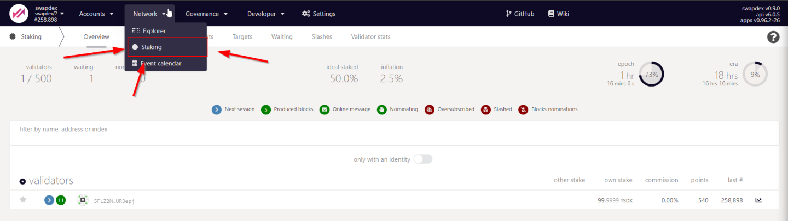
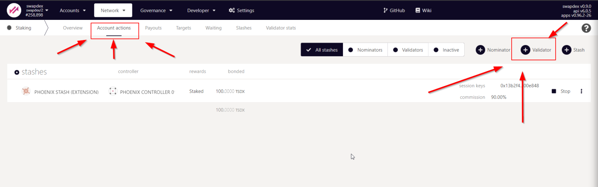
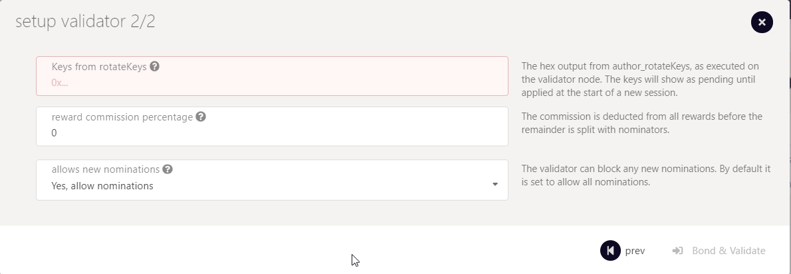

# <b>HOW TO SETUP A VALIDATOR</b>
---

The following guide will teach you how to set up a Zukma validator. The process of becoming a validator requires two steps. The first step is to set up a network node. The second step is to assign your node to your account and apply for validator candidacy.

Network validators are the foundation of a decentralized proof-of-stake network because they are responsible for concluding on a consensus by creating new and validating already produced blocks. That said, network validators are the prime target for adversaries that aim to sabotage the network. The Zukma has many layers to protect the network from attacks. The first layer is the security of each validator itself. Another layer is the slashing mechanism that detects validator nodes that display abnormal or dangerous behavior and punishes them with slashes. A slash will, in all cases, lead to the loss of funds. 

!!! warning
    Hence the warning: Running a validator on a live network is a lot of responsibility! You will be accountable for your stake and the stake of your current nominators. If you make a mistake and get slashed, your money and your reputation will be at risk. However, running a validator can also be very rewarding, knowing that you contribute to the security of a decentralized network while growing your stash.

## Step 1 - Setup a Network Node
---
## Requirements

You can operate a network node on a local computer, a professional server-rig in your basement, or on a remotely hosted virtual private server (VPS) in the clouds. It's up to you to choose the infrastructure you feel most comfortable with. What doesn't change are the requirements of a network node that operates as a validator. Validators should always be online and powerful enough to create and validate the authoring process of new blocks. If your validator is failing at one of these requirements, it will get punished by slashes.

!!! tip
    The most common way for a beginner to run a validator is on a VPS running Linux. You may choose whatever VPS providers that you prefer. 

We benchmarked the transactions weights on the Zukma network on standard hardware. We recommend that validators run at least the standard hardware to ensure they can process all blocks in time. The following are not minimum requirements, but if you decide to run with less than this, beware that you might have a performance issue.

### Lower-end Hardware :

- 6GB ram, 60 GB Storage, 2 CPU , <strong>stable server uplink connection with fixed IP</strong>

### Ideal Hardware :

- 16GB ram, 300 GB Storage, 6 CPU, <strong>stable server uplink connection with fixed IP</strong>

!!! info
    Anything between the lower-end and ideal hardware should be sufficient to run a validator on the Zukma network. 


## Using Ubuntu 21.10: 
---
### Update your Ubuntu
```
sudo apt-get update
```

### Network Time Protocol (NTP) Client

We currently require that the clocks of all validators on the network stay reasonably in sync. The NTP client is a piece of software that allows you to synchronize your server's clock with the clocks of the remaining servers connected to the blockchain. 

!!! info
    If you are using Ubuntu 18.04 / 19.04 / 20.04, NTP Client should be installed by default. You can check if your server is already running NTP by executing the following command:  
    ```
    timedatectl
    ```
    If NTP is installed and running, you should see System clock synchronized: yes (or a similar message).

Otherwise install the NTP client by running the following command:
```
sudo apt-get install ntp
```
NTP will be started automatically after install. You can query your NTP client for status information to verify that everything is working:
```
sudo ntpq -p
```
!!! warning
    Skipping this can result in the validator node missing block authorship opportunities. If the clock is out of sync (even by a small amount), the blocks produced by your validator may not get accepted by the network. 


## Installing the Zukma network Binary
---
### Install and enable Chrony
We learned in the previous step that the new versions of Ubuntu ship with the NTP client by default. However, Chrony is another time sync tool that delivers better and more stable performance. Therefore, we recommend installing and enabling Chrony on top of the NTP client to ensure synchronized clocks and uninterrupted validator operations.
```
sudo apt install chrony
sudo systemctl enable chrony
```

### Fundamental Security Measures
Security is of utmost importance if you consider operating a successful validator on a live network. We will show you how to create a fundamental layer of protection by installing a firewall and a fail2ban service.

**Configure a Firewall**

The default firewall configuration tool for Ubuntu is <a href="https://help.ubuntu.com/community/UFW" target="_blank"> UFW </a>. UFW stands for uncomplicated firewall and helps ease IP-tables firewall configuration, and provides a user-friendly way to create an IPv4 or IPv6 host-based firewall.

Configure firewall ports to allow SSH and Validator service to communicate.
```
sudo ufw allow 22
sudo ufw allow 30333
sudo ufw allow ntp
sudo ufw enable
```

**Setup Fail2Ban**

<a href="https://www.fail2ban.org/wiki/index.php/Main_Page" target="_blank"> Fail2Ban </a> is a tool that scans log files and bans IPs that show malicious signs for instance too many password failures, seeking for exploits, etc.
Generally Fail2Ban is then used to update firewall rules to reject the IP addresses for a specified amount of time.
It provides basic-level protection against distributed brute-force attacks.
```
sudo apt install -y fail2ban && sudo systemctl enable fail2ban && sudo service fail2ban start
```
!!! success
    Congratulations! You implemented a fundamental layer of protection.
 
### Install Zukma Validator binaries
The following command will fetch / download the Zukma validator binaries and copy them to a specific folder.
Check your ubuntu version and choose the correct file for it. <a href="https://download.zukma.io/zukma" target="_blank"> check your ubuntu version and choose the correct file for it </a>

```
wget https://download.zukma.io/zukma/{==FILE_NAME_FROM_ABOVE==} -O zukma && sudo chmod +x ./zukma && sudo mv ./zukma /usr/bin/zukma
```
!!! Warning
    Make sure that the link matches exactly and never use another source to download the binaries!

### Create User Account for Validator Operations
For security reasons we recommend to run a validator as non-root user.
For that we create a dedicated user account which will be used to run the validator.
```
sudo adduser zukma
```
!!! info
    when adding the new account you will be asked to provide a password and some additional information.
    Only the password is mandatory, the other parameters can be left blank.

### Create the Zukma Validator Service File
In the next step, we will use <a href="https://help.ubuntu.com/community/Nano" target="_blank"> Nano </a>, a simple terminal-based text editor, to create a file that contains service instructions.
The following command creates a file named `zukma.service` at the following location: `lib/systemd/system/`

```
sudo nano /lib/systemd/system/zukma.service
```

!!! warning
    The following code-block contains the content that must be inserted into the Nano text editor!
    Make sure to **change "A Node Name" and replace it your preferred name**


**Content of the zukma.service file**:
``` linenums="1"
[Unit]
Description=zukma Validator
After=network-online.target

[Service]
ExecStart=/usr/bin/zukma --port "30333" --name "{==A Node Name==}" --validator --chain zukma 
User=zukma
Restart=always
ExecStartPre=/bin/sleep 5
RestartSec=30s
LimitNOFILE=8192

[Install]
WantedBy=multi-user.target
```

Hit "ctrl+x", then press "y" to confirm the saving of the file and then hit "Enter" to exit.

!!! hint
    If you want to add a more ports to enable RPC calls, a websocket or monitoring, you can set it up by including the following flags in line 6. `--prometheus-port` `--rpc-port` and `--ws-port`

then start the service
```
sudo systemctl enable zukma && sudo service zukma start 
```

!!! Success
    Your validator will now run as a systemd process so that it will automatically restart on server reboots or crashes (and helps to avoid to getting slashed!)
    For more information on systemd you can watch this quick <a href="https://youtu.be/" target="_blank"> YouTube Tutorial </a>.

### Check if validator is started
To ensure that the Zukma Validator process works please execute the following command:
```
ps aux | grep zukma
```
You should see a similar output:
```
zukma  8108 9.9 21.0 1117976 419772 ?   Ssl May17 601:17 /usr/bin/zukma --port 30333 --name "A Node Name" --validator --chain zukma
```
Furthermore, you can monitor your validator's logs by executing the following command:
```
journalctl -u zukma.service --follow
```
To exit the 'follow' mode you need to hit ++ctrl+c++

### Reboot to be sure everything is restarted correctly:
```
sudo reboot -h now
```


Check if your node is appearing in the telemetry UI : <a href="https://telemetry.polkadot.io/#list/0x15bac4f0a9aad3f46c5fc067fdb59b3ff29738dcd491fe5e37b4b76121163471" target="_blank"> Telemetry UI </a>

!!! info
    If you want to find your node here you must have changed the name parameter in the previous step (`--name "A Node Name"`)

!!! success
    Congrats! If you checked and found your node on the telemetry page, you successfully set up your server to become a Zukma Validator!


## Part 2 - Assign the node to an account
---
The second part of this guide will complete the validator setup by connecting your server with your Substrate account.
Make sure you have some ZEP in your substrate wallet. In case you need ZEP please see the <a href="https://docs.zukma.org/get-started/claims/" target="_blank"> claim </a> section or watch our <a href="https://youtu.be/" target="_blank"> YouTube Walkthrough </a>. 

### What are stash and controller accounts?

The divison into two wallets or accounts is an additional security feature we implemented to protect your funds in case of fradulent attacks.

!!! hint
    In short:
    The **Stash-Account** is where you keep all the funds you want to stake. We recommend to protect it's private key with a hardware wallet like Ledger or Trezor.
    The **Controller-Account** is used to control actions related to your staking
    However, you can start and operate a validator without hardware wallets. This may be a viable option on a but is certainly not recommended once liqudity is provided.

The Stash Account will be used to bond/unbond your funds and to choose the address of the Controller Account.
The Controller Account will be used to take actions on behalf of the bonded funds. 
However, the Controller Account can't move the bonded funds out of the Stash Account.

!!! warning
    **Never disclose your Keystore file or your 12/24 words seed phrase.**

Before we start with the creation of both accounts please consider to download the Polkadot{.js} browser extension is our recommended way to create substrate based accounts. <a href="https://polkadot.js.org/extension/" target="_blank">Pokadot.js</a> is very comparable with Meta Mask for Ethereum especially in terms of usability, security and functionality.

!!! tip
    :point_right: Download <a href="https://polkadot.js.org/extension/" target="_blank">Pokadot.js</a> browser extension

### Create the Controller Account

**Step 1:** Open the <a href="https://polkadot.js.org/extension/" target="_blank">Pokadot.js</a> browser extension by clicking the logo on the top bar of your browser. You will see a browser popup, not unlike the one below.


**Step 2:** Click the big plus button or select "Create new account" from the small plus icon in the top right. The Polkadot{.js} plugin will then use system randomness to make a new seed for you and display it to you in the form of twelve words.


**Step 3:** You should back up these words as explained above. It is imperative to store the seed somewhere safe, secret, and secure. If you cannot access your account via Polkadot{.js} for some reason, you can re-enter your seed through the "Add account menu" by selecting "Import account from pre-existing seed".


**Step 4:** Name your Account

The account name is arbitrary and for your use only. It is not stored on the blockchain and will not be visible to other users who look at your address via a block explorer. If you're juggling multiple accounts, it helps to make this as descriptive and detailed as needed.

**Step 5:** Enter Password

You will use the password to encrypt this account's information. You will need to re-enter it when using the account for all outgoing transactions or sign a cryptographic message.

!!! warning
    Note that this password does NOT protect your seed phrase. If someone knows the twelve words in your mnemonic seed, they still control your account even if they do not know the password.

!!! hint
    :point_right: **Repeat this process to create your stash account**


### Create Session Keys:

Login to your VPS server.

Session keys are needed to associate your node with your controller account. To generate the session keys you can run the following command in your terminal: 

```
curl -H "Content-Type: application/json" -d '{"id":1, "jsonrpc":"2.0", "method": "author_rotateKeys", "params":[]}' http://localhost:9933
```

The output will have a hex-encoded "result" field. The result is the concatenation of the four public keys. Save this result for a later step.
Copy the session key. It will look like this:

```
0x13660593581b2e728ee32122636f8996c6fd9c22f33beaa05e2797899c5458b0c888149bf3c0b5ca7fb7296e69fefd85e4e3d5b76848db890207575e49031f37d846e78babf8051c123b498ffe6f12e712f97f6b2f3b54345ffe51145a16bb22187d415c2101b9883668ce93c46f7ba556b394c59781854737b6c941747c0964
``` 

### Apply on Zukma Explorer
---

- Visit the substrate <a href="https://polkadot.js.org/apps/?rpc=wss%3A%2F%2Fws.zukma.org/accounts" target="_blank">explorer</a>
- Go to the `Network Tab` -> `Staking` -> `Account Actions` (<a href="https://polkadot.js.org/apps/?rpc=wss%3A%2F%2Fws.zukma.org/staking/actions" target="_blank">Link</a>)


- Hit the `+ Validator` Button


- Fill in the form


- **Stash account** - Select your Stash account. In this example, we will bond 1000 ZEP, where the minimum bonding amount is 1. Make sure that your Stash account contains at least this much. You can, of course, stake more than this.
- **Controller account** - Select the Controller account created earlier. This account will also need a small amount of ZEP in order to start and stop validating.
- **Value bonded** - How much ZEP from the Stash account you want to bond/stake. Note that you do not need to bond all of the ZEP in that account. Also note that you can always bond more ZEP later. However, withdrawing any bonded amount requires the duration of the unbonding period.
- **Payment destination** - The account where the rewards from validating are sent. Payouts can go to any custom address. If you'd like to redirect payments to an account that is neither the controller nor the stash account, set one up. Note that it is extremely unsafe to set an exchange address as the recipient of the staking rewards.
---

- Paste the session key


Here you will need to input the Sesssion Keys, which is the Hex output from the command we executed earlier. The keys will show as pending until applied at the start of a new session.

The **"reward commission percentage"** is the commission percentage that you can declare against your validator's rewards. This is the rate that your validator will be commissioned with.

!!! Note: 
    setting a commission rate of 100% suggests that you do not want your validator to receive nominations.

You can also determine if you would like to receive nominations with the "allows new nominations" option.


- Hit bond & validate

- Visit the **<a href="https://polkadot.js.org/apps/?rpc=wss%3A%2F%2Fws.zukma.org/staking/waiting" target="_blank">Waiting Tab</a>** to see your validator waiting until the era finishes

!!! success
    Alright mate! You are all set :D

<br></br>

<p align=right> Written by Zukma Team </p>
