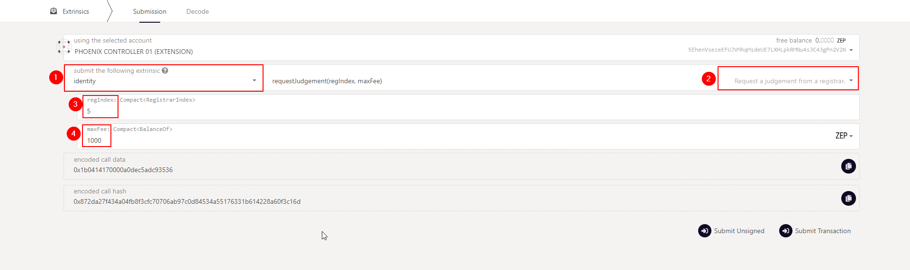

# <b>SET AN IDENTITY TO GAIN TRUST</b>
---

Zukma provides a naming system that allows participants to add personal information to their on-chain account and subsequently ask for verification of this information by registrars.

## **Setting an Identity**
---

Users can set an identity by registering through default fields such as legal name, display name, website, Twitter handle, Riot handle, etc. along with some extra, custom fields for which they would like attestations (see Judgements).

Users must reserve funds in a bond to store their information on chain: 0.033333, and 0.008333 per each field beyond the legal name. These funds are locked, not spent - they are returned when the identity is cleared.

The easiest way to create a on-chain identiy is to click the gear icon next to your account on the <a href="https://polkadot.js.org/apps/?rpc=wss%3A%2F%2Fws.zukma.org/explorer" target="_blank">Substrate Explorer App</a> and select "Set on-chain identity".

A pop-up window will appear, offering the default fields.

## **Judgement**
---
After a user injects their information on chain, they can request judgement from a registrar. Users declare a maximum fee that they are willing to pay for judgement, and registrars whose fee is below that amount can provide a judgement.

When a registrar provides judgement, they can select up to six levels of confidence in their attestation:

- Unknown: The default value, no judgement made yet.
- Reasonable: The data appears reasonable, but no in-depth checks (e.g. formal KYC process) were performed.
- Known Good: The registrar has certified that the information is correct.
- Out of Date: The information used to be good, but is now out of date.
- Low Quality: The information is low quality or imprecise, but can be fixed with an update.
- Erroneous: The information is erroneous and may indicate malicious intent.

A seventh state, "fee paid", is for when a user has requested judgement and it is in progress. Information that is in this state or "erroneous" is "sticky" and cannot be modified; it can only be removed by the complete removal of the identity.

Registrars gain trust by performing proper due diligence and would presumably be replaced for issuing faulty judgements.

To be judged after submitting your identity information, go to the "<a href="https://polkadot.js.org/apps/?rpc=wss%3A%2F%2Fws.zukma.org/extrinsics" target="_blank">Extrinsics UI</a>" and select the `identity pallet`, then `requestJudgement`. For the `reg_index` put the index of the registrar you want to be judged by, and for the `max_fee` put the maximum you're willing to pay for these confirmations

!!! hint
    If you don't know which registrar to pick, first check the available registrars by going to "<a href="https://polkadot.js.org/apps/?rpc=wss%3A%2F%2Fws.zukma.org/chainstate" target="_blank">Chain State UI</a>" and selecting identity.registrars() to get the full list.

### **Requesting a Judgement**

Requesting judgement follows the same process. Select one of the registrars from the query you made above. 
This will make your identity go from **"unjudged"** to **"waiting"**

At this point, direct contact with the registrar is required - the contact info is in their identity as shown above. Each registrar will have their own set of procedures to verify your identity and values, and only once you've satisfied their requirements will the process continue.

Once the registrar has confirmed the identity, a green checkmark should appear next to your account name with the appropriate confidence level.

!!! Warning
    Note that changing even a single field's value after you've been verified will un-verify your account and you will need to start the judgement process anew. However, you can still change fields while the judgement is going on - it's up to the registrar to keep an eye on the changes.

### **Cancel a Judgement**

You may decide that you do not want to be judged by a registrar (for instance, because you realize you entered incorrect data or selected the wrong registrar). In this case, after submitting the request for judgement but before your identity has been judged, you can issue a call to cancel the judgement using an extrinsic.

To do this, first, go to the "<a href="https://polkadot.js.org/apps/?rpc=wss%3A%2F%2Fws.zukma.org/extrinsics" target="_blank">Extrinsics UI</a>" and select the `identity pallet`, then `cancelRequest`. Ensure that you are calling this from the correct account (the one for which you initially requested judgement). For the `reg_index`, put the index of the registrar from which you requested judgement.

Submit the transaction, and the requested judgement will be cancelled.

## **Registars**
---

Registrars can set a fee for their services and limit their attestation to certain fields. For example, a registrar could charge 1 ZEP to verify one's legal name, email, and GPG key. When a user requests judgement, they will pay this fee to the registrar who provides the judgement on those claims. Users set a maximum fee they are willing to pay and only registrars below this amount would provide judgement.

### **Becoming a Registar**

To become a registrar, submit a pre-image and proposal into Democracy, then wait for people to vote on it. For best results, write a post about your identity and intentions beforehand, and once the proposal is in the queue ask people to second it so that it gets ahead in the referendum queue.

Here's how to submit a proposal to become a registrar:

Go to the Democracy tab, select "Submit preimage", and input the information for this motion - notably which account you're nominating to be a registrar in the identity.`setRegistrar` function.

Copy the preimage hash. Submit the preimage by signing a transaction.

Next, select "Submit Proposal" and enter the previously copied preimage hash. The locked balance field needs to be at least 100 ZEP. You can find out the minimum by querying the chain state under `Chain State` -> `Constants` -> `democracy` -> `minimumDeposit`.

## **Clearing and Killing an Identity**
---

**Clearing**: Users can clear their identity information and have their deposit returned. Clearing an identity also clears all sub accounts and returns their deposits.

To clear an identity:

1. Navigate to the Accounts UI.
2. Click the three dots corresponding to the account you want to clear and select `Set on-chain identity`.
3. Select `Clear Identity`, and sign and submit the transaction.

**Killing**: The Council can kill an identity that it deems erroneous. This results in a slash of the deposit.

  

 Written by Zukma Team 

