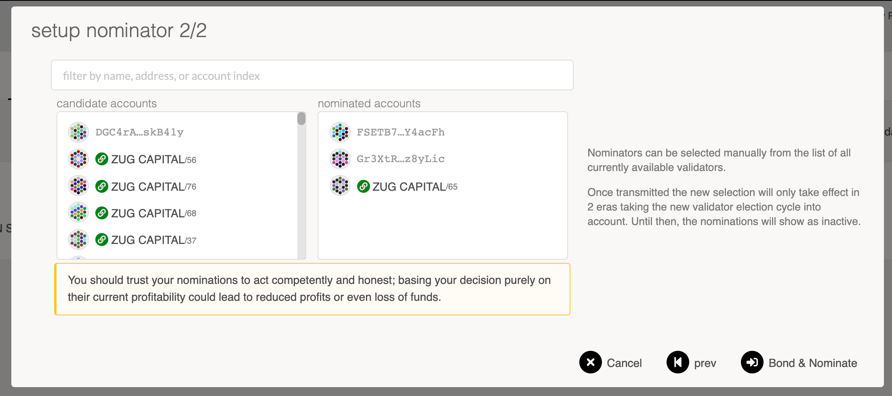

# <b>STAKING: BECOME A NOMINATOR</b>
---

If you are looking for a "set-it-and-forget-it" approach to leverage your ZEP coins, then becoming a Zukma nominator is the way to go. 
As a nominator, you are participating in the staking system of Zukma. Nominators use a specified amount of their funds to "vote" for Zukma validators.
Validators are network nodes that participate in the consensus and block authoring process. Your job as a nominator is to appoint (stake) your ZEP to elect the active set of validators. The active validators list consists of validators that received the most ZEP as "votes". If your chosen validator makes it to the active set, he will earn rewards and ideally share them with all of his nominators.

The main difference between a **Validator** and a **Nominator** is the active participation in the network. Validators engage in the block production and finality mechanisms, whereas **nominators** take a more passive role with the above mentioned "set-it-and-forget-it" approach. Being a nominator does not require running a node of your own or worrying about online uptime. However, a good nominator performs due diligence on the validators that they elect. When looking for validators to nominate, a nominator should pay attention to their reward percentage for nominating a specific validator - as well as the risk that they bear of being slashed if the validator gets slashed.

## **Setting up Controller and Stash Accounts**
---

!!! info
    In this guide, we use the terms "account" and "wallet" interchangeably.

Nominators are recommended to set up two separate stash and controller accounts. Explanation and reasoning for generating distinct accounts for this purpose is elaborated in the <a href="https://docs.zukma.org/deep-dives/substrate_keys/" target="_blank">keys section</a> of the Wiki.

You can generate your stash and controller account via any of the recommended methods that are detailed on the <a href="https://docs.zukma.org/what-to-try/account-generation/" target="_blank">account generation page</a>.

!!! hint
    Payouts can go to any custom address. If you'd like to redirect payments to an account that is neither the controller nor the stash account, set one up. Note that it is extremely unsafe to set an exchange address as the recipient of the staking rewards.

## **Using Zukma Substrate Explorer**
---

### Step 1: Bond your coins
On the <a href="https://polkadot.js.org/apps/?rpc=wss%3A%2F%2Fws.Zukma.network#/explorer" target="_blank">Substrate Explorer</a> UI navigate to the "Staking" tab (within the "Network" menu).

The "Staking Overview" subsection will show you all the active validators and their information:

- (1) their identities
- (2) the amount of ZEP that are staking for them
- (3) amount that is their own provided stake 
- (4) how much they charge in commission
- (5) the era points they've earned in the current era
- (6) and the last block number that they produced. 

!!! attention
    **What does oversubscribed mean?**  
    Maximum number of Validators a Nominator is able to stake/delegate to is 16.
    Validators can receive up to 256 nominations before they are oversubscribed. (76,800 nominations will receive rewards) Once oversubscribed, the amount of ZEP nominated is deciding whether you'll receive rewards or not.

If you click on the (7) chart button, it will take you to the "Validator Stats" page for that validator that shows you more detailed and historical information about the validator's stake, rewards, and slashes.

The <a href="https://polkadot.js.org/apps/?rpc=wss%3A%2F%2Fws.zukma.org/staking/actions" target="_blank">Account actions</a> subsection allows you to stake and nominate.
Pick `Account actions` underneath `Network` > `Staking`, then click the `+ Nominator` button.

You will see a modal window that looks like the below:

Select a `value bonded` that is less than the total amount of ZEP you have, so you have some leftover to pay transaction fees. Transaction fees are currently at least 0.01 ZEP, but they are dynamic based on various factors, including a load of recent blocks.

<!--Also, be mindful of the reaping threshold - the amount that must remain in an account lest it be burned. That amount is 0.01 at Zukma, so it's recommended to keep at least 0.1 ZEP in your account to be on the safe side.-->

Choose whatever payment destination makes sense to you. If you're unsure, you can choose "Stash account (increase amount at stake)" to simply accrue the rewards into the amount you're staking and earn compound interest.

### Step 2: Nominate a Validator

You are now bonded. Being bonded means your tokens are locked and could be slashed if the validators you nominate misbehave. All bonded funds can now be distributed to up to 16 validators. Be careful about the validators you choose since you will be slashed if your validator commits an offense.

Click on `Nominate` on an account you've bonded, and you will be presented with another popup asking you to select some validators.

Select them, confirm the transaction, and you're done - you are now nominating. Your nominations will become active in the next era. Eras last 6 hours on Zukma - depending on when you do this, your nominations may become active almost immediately, or you may have to wait nearly the entire 6 hours before your nominations are active. You can check how far along Zukma is in the current era on the Staking page.

Assuming at least one of your nominations ends up in the active validator set, you will start to get rewards allocated to you. To claim them (i.e., add them to your account), you must manually claim them. You can do it yourself or have the validator you staked to initiate a claim. This is to help optimize the effectiveness and storage of payouts on Zukma. See the Claiming Rewards section of the Staking wiki page for more details.

!!! success
    Congrats! You successfully staked ZEP on the substrate side of the Zukma Network 

### Step 3: Stop Nominating

At some point, you might decide to stop nominating one or more validators. You can always change who you're nominating, but you cannot withdraw your coins unless you unbond them. Detailed instructions are available here.

  

 Written by Zukma Team 

